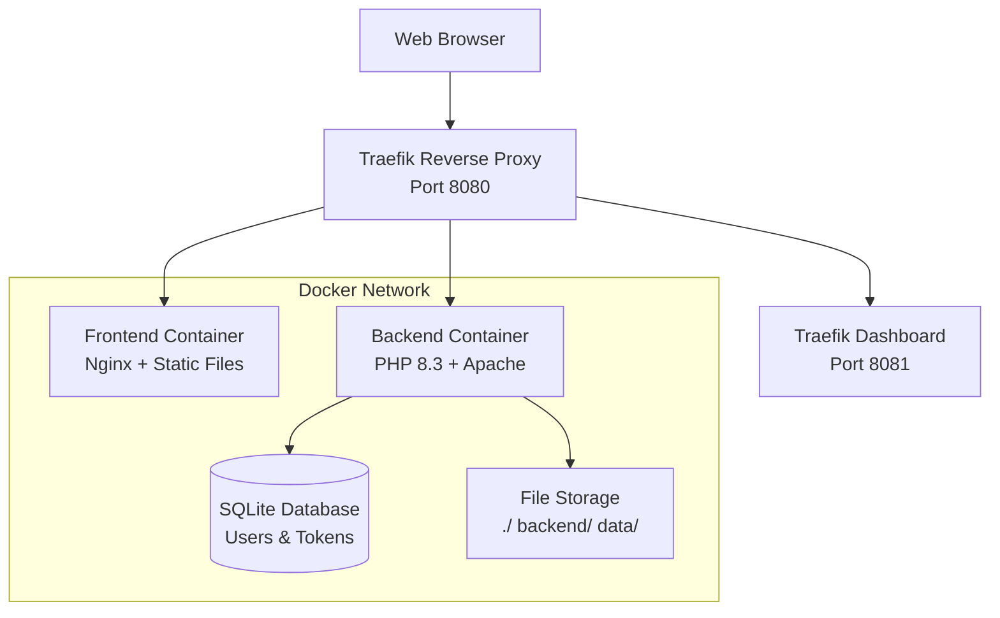

# CloudBox - Cloud Storage Platform

A containerized cloud storage solution with PHP REST API backend and HTML/ JavaScript frontend. Built with Docker and Traefik for easy deployment and scalability.

> ⚠️ **Important Notice**: This is a **demonstration/ educational project** and is **NOT intended for production use**. The project is not actively maintained and lacks enterprise-grade security features required for production environments.

## Features

### Backend (PHP 8.3 + Apache)

- **REST API**: Complete file and folder management
- **Secure Authentication**: Token-based auth with SQLite storage
- **File Operations**: Upload, download, create, delete files and folders
- **Security**: Path traversal protection, secure password hashing
- **CORS Support**: Cross-origin requests enabled
- **Multiple File Types**: Images, videos, audio, text, and documents

### Frontend (HTML/ CSS/ JavaScript SPA)

- **Modern Interface**: Clean, responsive single-page application
- **File Browser**: Navigate folders and preview files
- **Upload System**: Drag-and-drop file uploads
- **Authentication**: Secure login/ logout with session management
- **Auto-logout**: Session timeout for enhanced security
- **File Operations**: Create folders, text files, delete items

## Architecture



## Quick Start

1. **Start application**

   ```bash
   docker-compose up -d
   ```

2. **Access**

   - **Application**: http:/ / localhost:8080
   - **Traefik Dashboard**: http:/ / localhost:8081/ dashboard/
   - **Login**: `admin` / `admin`

3. **Management**

   ```bash
   # View logs
   docker-compose logs -f

   # Stop
   docker-compose down

   # Rebuild
   docker-compose up --build -d
   ```

## API Endpoints

| Method   | Endpoint        | Description                  |
| -------- | --------------- | ---------------------------- |
| `POST`   | `/ api/ login`  | User authentication          |
| `GET`    | `/ api/ logout` | End session                  |
| `GET`    | `/ api/ {path}` | List directory or download   |
| `POST`   | `/ api/ {path}` | Create folder or upload file |
| `DELETE` | `/ api/ {path}` | Delete file or folder        |

Authentication: `Authorization: Basic base64(username:token)`

## Production Readiness & Maintenance Status

### **NOT FOR PRODUCTION USE**

This project is **strictly for educational and demonstration purposes**. It should **NEVER be deployed in production environments** due to the following limitations:

#### Security Limitations

- **Basic Authentication**: Simple token-based auth without advanced security measures
- **No Rate Limiting**: API endpoints are not protected against abuse
- **No Input Validation**: Limited sanitization of user inputs
- **Default Credentials**: Ships with default admin/ admin credentials
- **No HTTPS**: Only HTTP support (no SSL/ TLS encryption)
- **File Upload Risks**: No comprehensive file type validation
- **No User Management**: Single admin user system only

#### Scalability & Reliability Issues

- **SQLite Database**: Not suitable for concurrent users or high load
- **No Backup System**: No automated backup or recovery mechanisms
- **Single Point of Failure**: No redundancy or failover capabilities
- **No Monitoring**: Lacks comprehensive logging and monitoring
- **No Error Handling**: Basic error responses without detailed logging

#### Maintenance Status

- **Not Actively Maintained**: This project is not under active development
- **No Bug Fixes**: Issues and vulnerabilities will not be regularly addressed
- **No Updates**: Dependencies and security patches are not maintained
- **No Support**: No official support or documentation updates provided
- **Security Patches**: No guarantee of timely security updates

#### Recommended Alternatives

For production use, consider these enterprise-grade solutions:

- **NextCloud** - Self-hosted cloud storage platform
- **OwnCloud** - Enterprise file sharing solution
- **MinIO** - High-performance object storage
- **Seafile** - Professional file sync and sharing platform

### Suitable Use Cases

This project **IS suitable** for:

- **Learning Docker & PHP**: Understanding containerized applications
- **Educational Purposes**: Teaching web development concepts
- **Prototyping**: Quick demos and proof-of-concepts
- **Local Development**: Testing and development environments
- **Code Reference**: Studying implementation patterns

## License

MIT License
